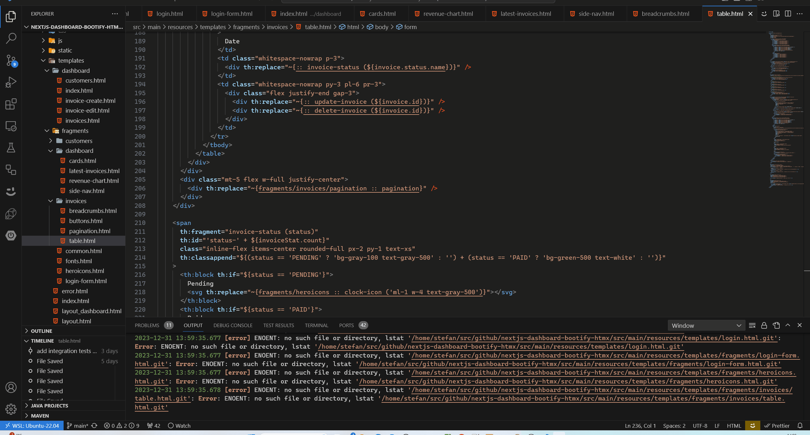

# thymeleaf-navigate README

A VS Code extension to navigate Thymeleaf 3 fragments in text files like HTML or XML.

## Features

Fragment definitions like `
` are recognized in text files.
Fragment expressions referencing those definitions like
`
` are then recognized and made navigable via
`Ctrl+Click`.

## Requirements

Thymeleaf syntax before version 3 is not supported.

## Extension Settings

- `thymeleaf-navigate.language`: Language mode for Thymeleaf files, e.g. "html" or "xml"; defaults to "html".
- `thymeleaf-navigate.fragmentsPath`: Path to search for Thymeleaf fragments, defaults to "src/main/resources/templates".

## Known Issues

Fragment links to files not opened before might not navigate to the fragment definition's line on the first time.

Fragment selectors using CSS selectors like `
` are not supported.

Dynamic fragment selectors like `
` are not supported.

## Release Notes

### 1.1.0

Add settings for language and fragments path.

### 1.0.4

Initial release
